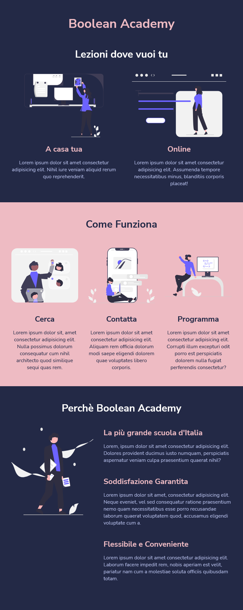

# Responsive-wannabe

**Initial commit**: 17/02/23

**Tecnologie:** HTML, CSS e @media-query.

📱 🖥️ Questo è il mio primo approccio con i layout responsive, sempre per Boolean!

In questo esercizio usando le media-query e un approccio Mobile First, ho creato un layout capace di adattarsi alle dimensioni di vari device... all'inizio mi sembrava complicato, ma dopo averlo fatto vi posso assicurare che non c'è stata nessuna magia, quella arriverà dopo con Bootrap 😉

🖇️ Repository:
https://github.com/cyberfolk/html-css-responsive-layout

<table cellpadding="0">
  <tr style="padding: 0">
    <td valign="top" width="33%">
        <h2 align="center">Desktop</h2>
        </td>
    <td valign="top" width="33%">
        <h2 align="center">Mobile</h2>
        </td>
    <td valign="top" width="33%">
        <h2 align="center">Tablet</h2>
        </td>
  </tr>
</table>
