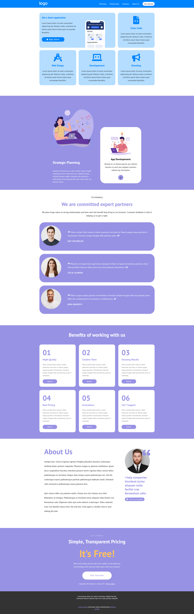

# Responsive 2-advanced

**Initial commit**: 20/02/23

**Tecnologie:** HTML, CSS e @media-query.

In questo esercizio per evitare che il file style.css diventase troppo grande ho deciso di suddividerlo per argomenti in file diversi.

-   In **media_query.css** è contenuta la logica responsive.
-   In **grid.css** è contenuta un griglia dalle logiche che si ispirano a bootstrap.
-   In **debug.css** sono contenute le classi css che mi hanno aiutato per fare il layout a blocchi colorati.
-   E poi ci sono gli altri fogli di stile come **utility.css**, **common.css** e **style.css**

<table cellpadding="0">
  <tr style="padding: 0">
    <td valign="top" align="center" width="33%">
        <h2 >Desktop</h2>
        
    </td>
    <td valign="top" align="center" width="33%">
        <h2>Tablet</h2>
        
    </td>
    <td valign="top" align="center" width="33%">
        <h2>Mobile</h2>
        
    </td>
  </tr>
</table>
